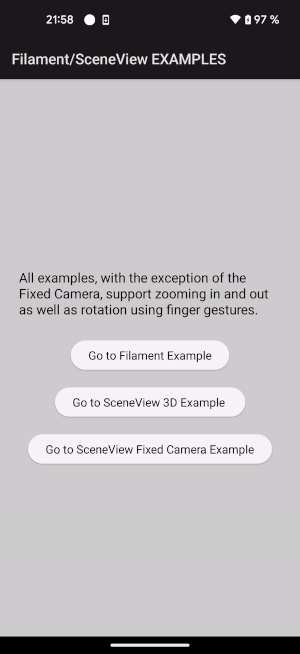

# Android3DEnginesExamples

## Overview
Android3DEnginesExamples is a showcase of 3D rendering capabilities using different engines on Android. This project currently features examples using Google Filament and SceneView. It includes three main activities, each demonstrating different aspects of 3D model rendering and manipulation.

### Activities
### 1. Filament Activity
This activity demonstrates the use of the **Google Filament** rendering engine. It focuses on rendering a 3D model and includes features such as custom settings for detailed asset rendering. The example highlights Filament's capabilities in rendering high-quality visuals, though it may not support all assets as SceneView does.
#### Screen record example:
  
   
  
 
### 2. SceneView3DActivity

This activity uses **SceneView** to render various 3D models. It showcases different model object capabilities, including animations, movements, and visibility changes. The activity also demonstrates interactive elements, such as object movement controls, and offers insights into the usage of SceneView for complex 3D modeling.
#### Screen record example:
  
  
   
  
### 3. SceneViewFixedCameraActivity
Focusing on a top-down camera perspective, again using **SceneView** 3D engine, this activity mimics a 2D view while rendering a 3D scene. It uses assets from the **RemoteParkingAssist** app to demonstrate loading of the same resource files, in a fixed camera view in a 3D environment. A show of a bird's-eye view of the scene.
#### Screen record example:
  
 
  
 

 

## Contributing
Even though the investigation task is still ongoing, the contributions to **Android3DEnginesExamples** are welcome. :) 
